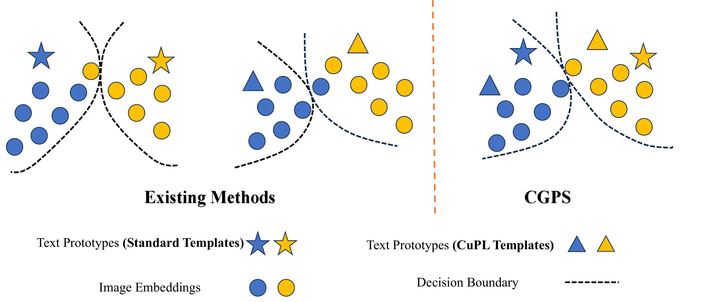

<div align="center">

# Consensus-Guided Prompt Selection

### Test-Time Adaptation of Vision-Language Models

[](https://github.com/Tom-b-w/CGPS/actions/workflows/ci.yml)

</div>

Research code for **Consensus-Guided Prompt Selection (CGPS)**, a training-free
plug-in for online test-time adaptation with CLIP.

<p align="center">
  
</p>

## Highlights

- **Consensus-guided accumulation:** retain reliable unlabeled samples when
  classifiers built from standard and CuPL prompts agree with sufficient
  confidence.
- **Visual-guided prompt selection:** score candidate prompts against visual
  class centroids and form a refined text classifier once during the stream.
- **Training-free and plug-and-play:** no gradient updates to the CLIP backbone.
- **Reproducible protocol:** fixed hyperparameters, deterministic seeds,
  resumable per-dataset outputs, tests, and documented third-party provenance.

## Main results

Top-1 accuracy (%) with CLIP ViT-B/16 on ten cross-domain datasets. Values are
transcribed from the manuscript; they are reference values, not a fresh rerun.

| Method | FGVC | Caltech101 | Cars | DTD | EuroSAT | Flowers | Food101 | Pets | SUN397 | UCF101 | Avg. |
|:--|--:|--:|--:|--:|--:|--:|--:|--:|--:|--:|--:|
| TDA | 23.91 | 94.24 | 67.28 | 47.40 | 58.00 | 71.42 | 86.14 | 88.63 | 67.62 | 70.66 | 67.53 |
| TDA + CGPS | 28.77 | 94.48 | 67.27 | 51.89 | 60.96 | 74.83 | 85.83 | 90.49 | 68.42 | 73.46 | 69.64 |
| DOTA | 26.25 | 94.16 | 69.56 | 47.64 | 62.78 | 75.23 | 87.08 | 92.01 | 69.80 | 72.54 | 69.71 |
| DOTA + CGPS | 29.22 | 94.69 | 69.53 | 56.68 | 62.40 | 77.14 | 87.09 | 93.40 | 70.95 | 76.08 | 71.72 |

The machine-readable table is available at
[`results/paper_results.csv`](results/paper_results.csv).

## Installation

The paper environment uses Python 3.10, PyTorch 1.12.1, torchvision 0.13.1,
and CUDA 11.3.

```bash
conda env create -f environment.yml
conda activate cgps
```

Model weights and datasets are not stored in Git. The vendored CLIP loader
downloads its backbone on first use unless it is already cached.

## Data preparation

Place the ten datasets under one root directory according to
[`docs/DATASETS.md`](docs/DATASETS.md): FGVC-Aircraft, Caltech-101, Stanford
Cars, DTD, EuroSAT, Oxford Flowers 102, Food-101, Oxford-IIIT Pets, SUN397,
and UCF-101.

## Evaluation

Run one dataset on one GPU:

```bash
CUDA_VISIBLE_DEVICES=0 python scripts/evaluate.py \
  --data-root /path/to/data \
  --datasets dtd \
  --output outputs/dtd_seed42.json
```

Run the complete ten-dataset protocol with resumable per-dataset outputs:

```bash
bash scripts/reproduce.sh /path/to/data 0
```

The four main result keys are `dota_official`, `refine_hc`, `tda_baseline`,
and `tda_refine_hc`. See
[`docs/REPRODUCIBILITY.md`](docs/REPRODUCIBILITY.md) for the fixed protocol and
limitations.

## Development checks

```bash
python -m pip install -e .
python -m pytest tests -q
python -m ruff check src tests scripts/evaluate.py
python -m compileall -q src scripts third_party/dota
python scripts/evaluate.py --help
```

## Repository structure

```text
CGPS/
├── assets/                 # Method figure and prompt candidates
├── configs/                # Paper protocol manifest
├── docs/                   # Dataset, provenance, and reproduction notes
├── results/                # Manuscript reference table
├── scripts/                # Evaluation and full-suite entry points
├── src/cgps/               # Reusable CGA/VGPS components
├── tests/                  # Deterministic unit tests
└── third_party/dota/       # DOTA/CLIP evaluation dependencies
```

## Reproducibility note

The camera-ready evaluator is preserved in `scripts/camera_ready_runner.py`.
The public cleanup normalizes paths, imports, CLI options, device handling, and
the default dataset list without rewriting the CGPS or baseline update
equations. The reusable `src/cgps/` package extracts the core CGA/VGPS logic for
testing and integration; paper numbers should be produced with the evaluator.

Repository structure, unit tests, dataset construction, and a single-sample GPU
forward pass have been validated locally. A complete ten-dataset numerical
rerun has not been performed during repository cleanup. Details are recorded in
[`docs/VALIDATION.md`](docs/VALIDATION.md).

## Third-party code

The evaluator includes DOTA source code and ReTA prompt resources with retained
license notices and recorded upstream commits. See
[`docs/THIRD_PARTY.md`](docs/THIRD_PARTY.md) before redistribution.

## License

CGPS is released under the [MIT License](LICENSE). Vendored components and
prompt resources retain their upstream licenses; see the provenance notes for
details.
